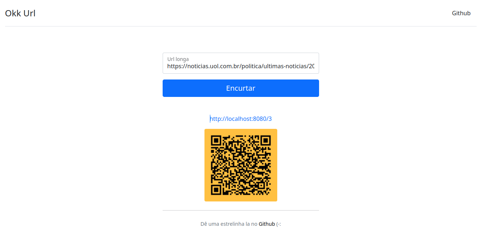
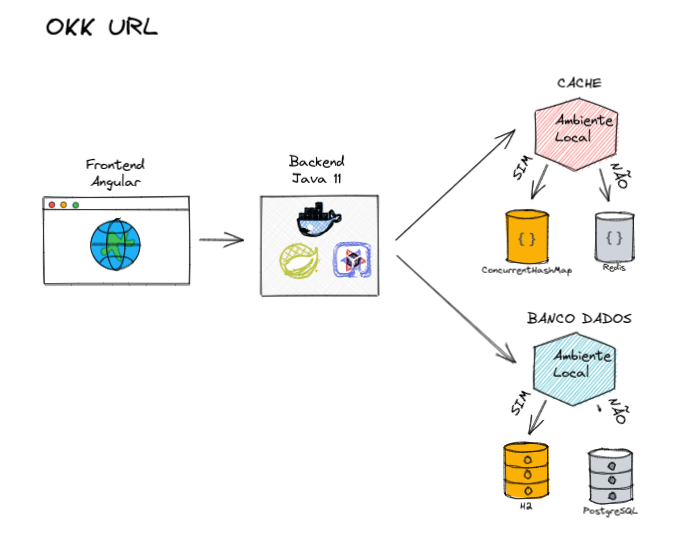
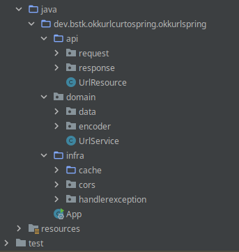

# Okk Url

- [Visão Geral](#visão-geral)
- [Arquitetura](#arquitetura)
    - [Cache](#cache)
  - [Banco de Dados](#banco-de-dados)
- [Entrutura do projeto](#entrutura-do-projeto)
  - [Curiosidades](#curiosidades)
- [Executando o projeto](#executando-o-projeto)


# Visão Geral

Um tempo atrás o **Encurtador de Url** parecia ser o novo **CRUD**, isso pela grande quantidade de posts em blogs, videos e outros materias que se via na internet. Diante disso, decidi implementar minha versão.

Você irá encontrar uma versão utilizando **Spring Boot** e outra com **Quarkus** que são os dois frameworks que acredito serem os maiores da comunidade Java quando o assunto é desenvolvimento web e de api's.




# Arquitetura

Como disse é simples e funcional, contendo apenas um frontend em **Angular** e uma api rest de backend (**Spring Boot** / **Quakus / e Java 11** ) na qual possui dois endpoints: 
 - ```POST: /url``` - Encurtar uma url longa e gera um QrCode
 - ```GET:   /{url_token}``` - Redirecionar para url longa dado uma url curta

### Cache
Quando executado local (no IDE), é utilizado um **Cache Local** (uma simples implementação utilizando ```ConcurrentHashMap```).

Quando executado em ambiente de dev/container, é utilizado o **Redis**.

## Banco de Dados
Quando executado local (no IDE), foi utilizado o **H2**

Quando executado em ambiente de dev/container, é utilizado o **Postgresql**.




# Entrutura do projeto

A boa e velha arquitetura em camadas, mas usando de forma vertical.
E sim, bastante testes unitários.




## Curiosidades

Ao longos dos testes uma coisa que causou bugs e desentendimento foi o uso incorreto do status http, especificamente no endpoint ```/{ulr_token}``` na qual faz o redirecionamento de uma url curta para uma url longa.

No inicio eu estava retornando ```HttpStatus.MOVED_PERMANENTLY = 301``` pois em muitos lugares que li a respeito de se projetar um encurtador de url deveria ser o correto. Porém quando se utliza ```HttpStatus.MOVED_PERMANENTLY``` o navegador guarda um cache (quase que permanente) da url acessada, de forma que se eu apagar o banco de dados e encurtasse outra url e gerasse o mesmo token, iria redirecioar para url anterior causando inconsistência. Então decidi por utilizar o ```HttpStatus.FOUND = 302```, onde esse não guarda cache e sempre faz uma chamada ao backend que diferente do ```HttpStatus.MOVED_PERMANENTLY = 301``` faz uma unica chamada ao backend.

Claro, isso foi em ambiente de testes locais, no qual eu zerava o banco toda hora. Num ambiente de produção acredito que o mais correto é de fato retornar um ```HttpStatus.MOVED_PERMANENTLY = 301```.

# Executando o projeto

A forma mais rapido de você executar este projeto é através do **Docker** e **Docker Compose** que irá subir quatro contanainers:
```Frontend Angular```, ```Backend Java Spring / Quarkus```, ```Redis``` e ```Postgresql```.     
Veja como é facil:

1 - Clonando o repositorio:
> ```git clone https://github.com/BSTK/okk-url-curto.git```

2 - Indo até a pasta contendo os arquivos do docker-composer
> ```cd ./okk-url-curto/okk-url-docker```

3 - Executando todo projeto e suas dependências
> ```docker-compose -f docker-compose-[spring / quarkus].yml up -d```

4 - Abra no novegador
> ```http://localhost:4200/#/okk-url/```

5 - Para finalizar, basta parar os containers
> ```docker-compose -f docker-compose-[spring / quarkus].yml down```

